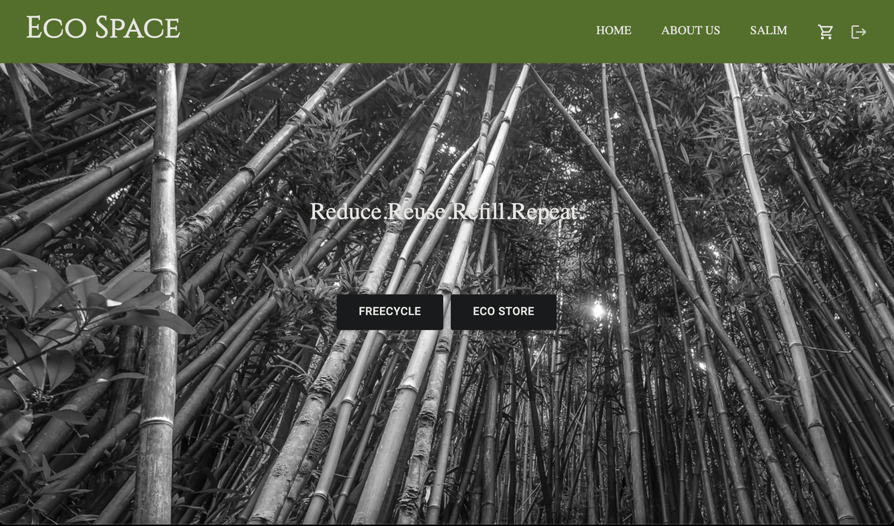
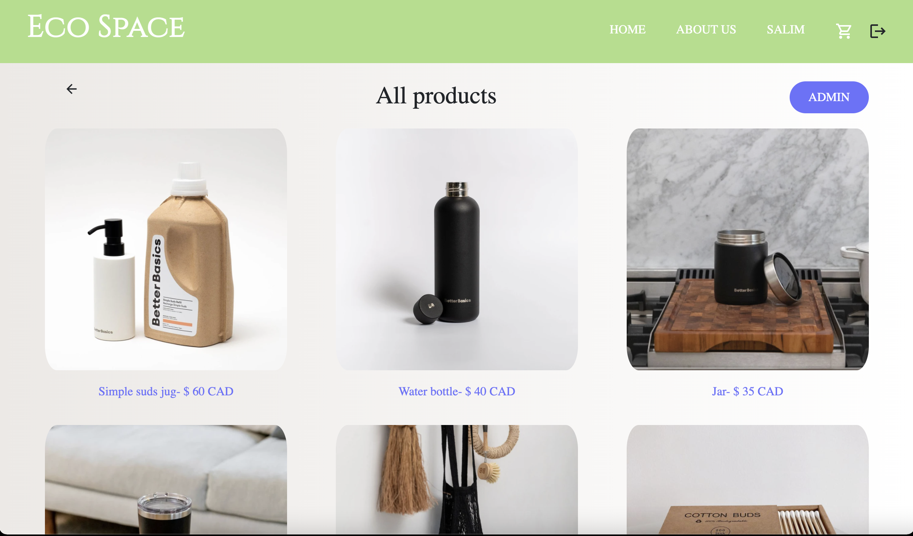
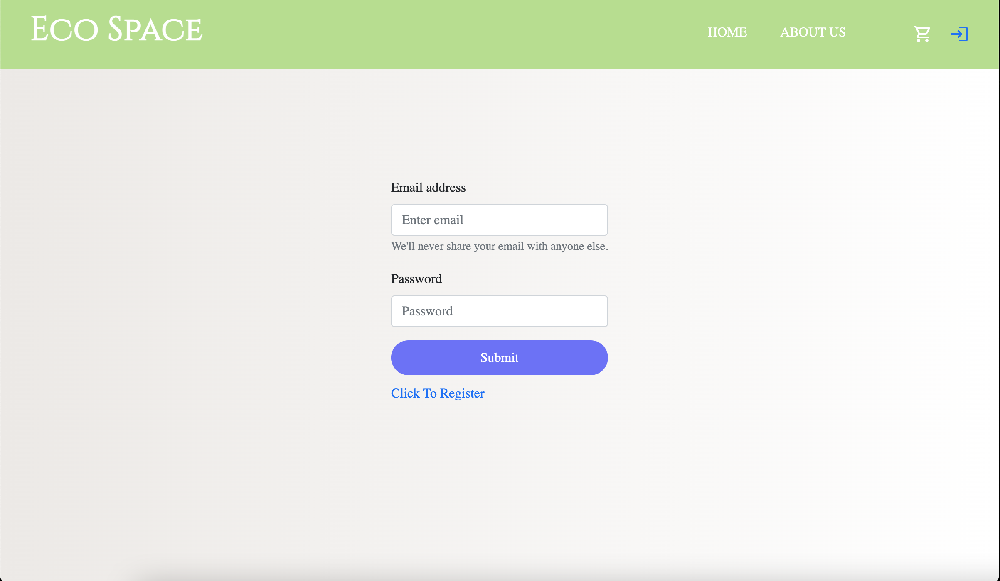

# Eco Space

A mini e-commerce application for environemntally sustainable products. Also features a freeCycle network to encourage reuse.

# About Eco Space

My group members and I share a vision that can help transition to a zerowaste lifestyle. The problem is our landfills and oceans are polluted with plastic debris among other things. And the solution is very simple but it requires a collective effort.

And that is where Eco space comes in. We all can do with less plastic in our lives. And the underpinning of Eco space is to reduce all type of plastic waste, especially sing-use plastics, and to find eco-friendly, sustainable alternatives to everyday products that typically have impossible-to-recycle plastic packaging. While also featuring a section of the app that is dedicated to encourage reuse. This section is a free cycle network where users can post items they no longer use so someone else may put the item to good use.

# Features

1. user authentification.
2. live messaging (socket.io)
3. Payment (stripe Api)
4. so much more ...

# Tech Stack

0. React
1. Nodejs
2. postegresSQL
3. Express
4. socket.io
5. Material Ui
6. stripe
7. Boostraps-react

# ScreenShots

# Landing Page

# Store View

# Login/register view

